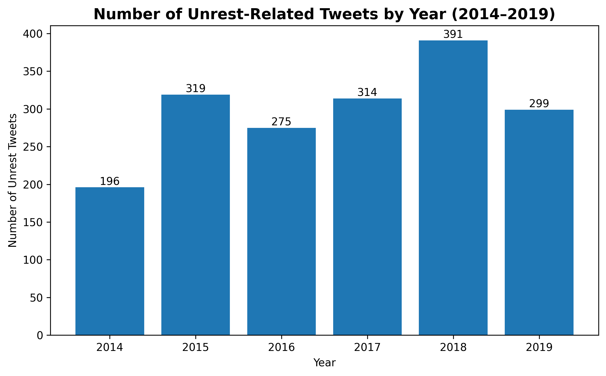
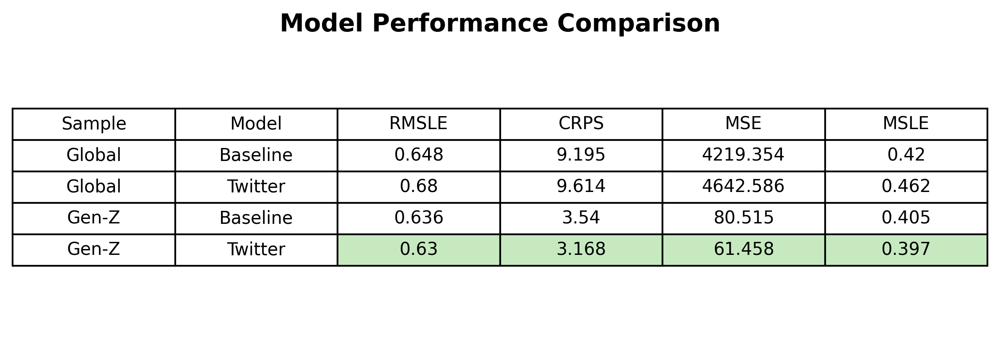
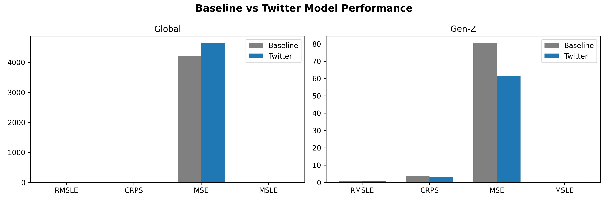

# Conflict Forecasting with Social Media Signals

## Overview
This project evaluates whether incorporating social media data improves the prediction of conflict and unrest within a ViEWS-inspired forecasting framework.

Specifically, I compare:
- A **baseline model** using only traditional structural indicators (ViEWS data)
- A **Twitter-enhanced model** that adds aggregated social media features

The goal is to test whether real-time online signals can improve predictive performance, particularly in contexts where social media activity reflects real-world unrest.

---

## Research Question
Can social media data (Twitter) improve the prediction of conflict and unrest beyond traditional political and economic indicators?

---

## Data Sources

### 1. ViEWS Data
- Country-month level dataset
- Includes:
  - Conflict history
  - Economic indicators
  - Political variables

### 2. Twitter Data
- Based on the Civil Unrest on Twitter (CUT) dataset
- ~4,300 annotated tweets (2014–2019)
- Uses ~700+ keywords related to unrest (e.g., protest, strike, police)

---

## Data Processing

### Step 1: Aggregate Twitter Data
Tweets were aggregated to the **country-month level** to match the ViEWS structure.

### Step 2: Feature Engineering
Four Twitter-based features were created:
- Number of unrest-related tweets
- Number of non-unrest tweets
- Proportion of unrest tweets per month
- Yearly normalized unrest activity

### Step 3: Merge Datasets
The Twitter features were merged with the ViEWS dataset to create the Twitter-enhanced dataset.

---

## Modeling Approach

### Model Type
- **XGBoost (XGBRegressor)**

### Ensemble Design
- Mini-ensemble of 3 submodels:
  - `bittersweet_symphony`
  - `brown_cheese`
  - `car_radio`

Each model:
- Uses the same data
- Has different hyperparameters

Final prediction:
- Average of the 3 models

---

## Experimental Setup

- Train period: months 409–460 (~2014–2018)
- Test period: months 461–480 (~2018–2019)
- Same split used for both models

Two datasets:
1. Baseline (ViEWS only)
2. Twitter-enhanced (ViEWS + Twitter features)

---

## Evaluation Metrics

- **RMSLE** (Root Mean Squared Log Error)
- **MSE** (Mean Squared Error)
- **CRPS** (Continuous Ranked Probability Score)
- **MSLE**

👉 Lower values = better performance

---

## Results

### Global Sample
- Twitter-enhanced model performs worse
- Higher error metrics indicate reduced accuracy
- Suggests Twitter introduces noise at global scale

### Gen-Z Protest Countries
- Twitter-enhanced model performs better across all metrics
- Lower error values indicate improved prediction

👉 Key Insight:
Social media improves prediction **only in specific contexts**

---

## Interpretation

- In some countries, social media reflects:
  - protest activity
  - public dissatisfaction
  - mobilization

- In others, it does not → leading to noise

---

## Key Contributions

- Integrates social media signals into a conflict forecasting framework
- Demonstrates that model performance is **context-dependent**
- Provides a simplified, reproducible version of a ViEWS-style pipeline

---

## Limitations

- Small Twitter dataset (~4K tweets)
- English-only tweets
- Simplified model (mini-ensemble, not full ViEWS pipeline)
- Twitter may not represent all countries equally

---

## Future Work

- Expand dataset (more tweets, more languages)
- Include other platforms (Facebook, Instagram, TikTok)
- Extend ensemble to better match full ViEWS framework
- Test on broader country samples

---

## Project Structure
